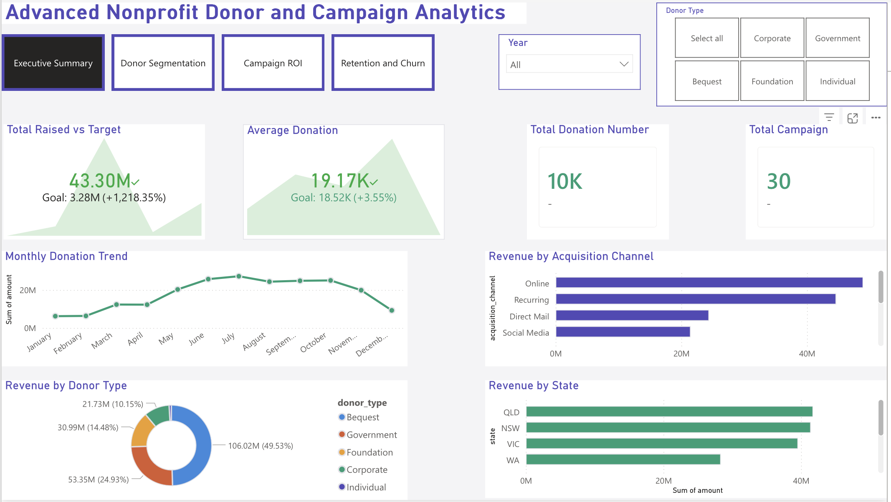
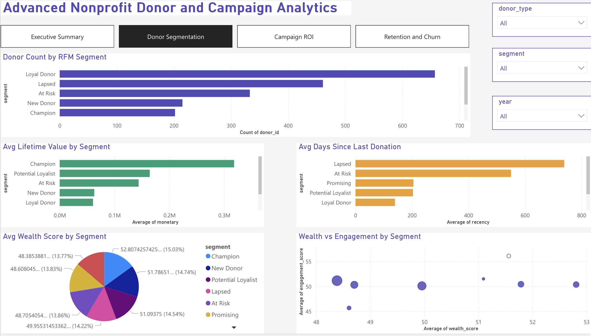
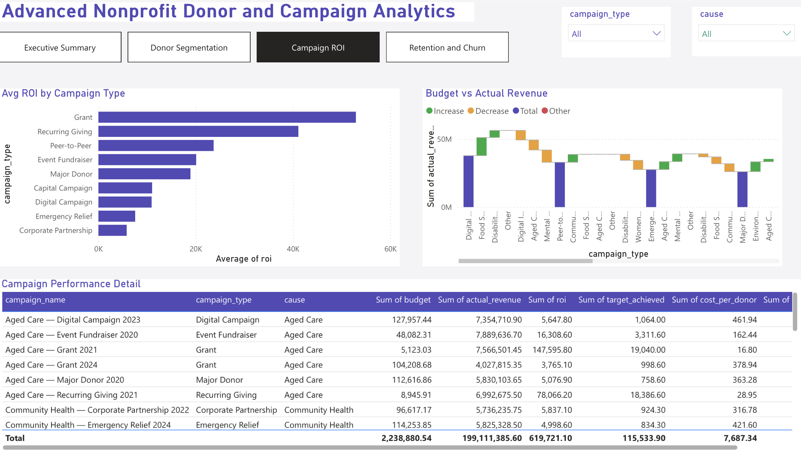
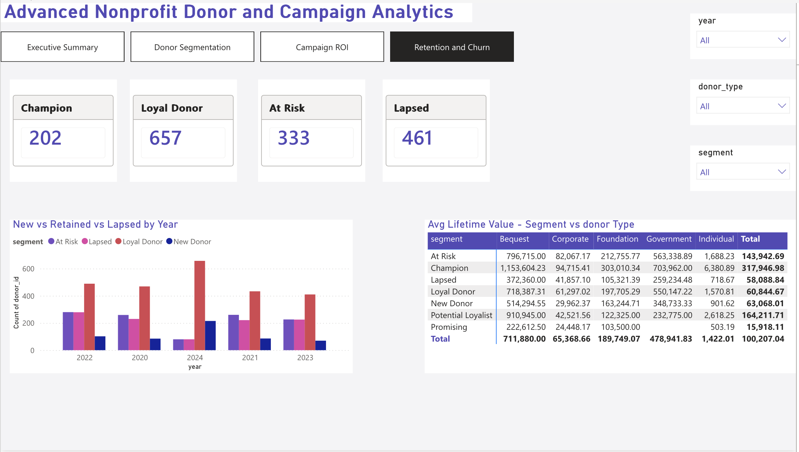

# Advanced Nonprofit Donor & Campaign Analytics

Comprehensive end-to-end analytics project for a not-for-profit organisation — covering donor lifetime value, RFM segmentation, campaign ROI, retention and churn analysis, and communication effectiveness.

Built to demonstrate advanced SQL, Python, and Power BI skills across a complex multi-table data model with 34,000+ rows of realistic synthetic data.

---

## Live Power BI Dashboard

[View Interactive Dashboard on Power BI Service](https://app.powerbi.com/groups/71156bbb-2668-49ad-a42e-a4db44ec0e98/reports/99bf88c7-f6e4-4dd5-848d-8236e49ffb10?ctid=66e44254-c0ce-4745-9255-907eee03faf6&pbi_source=linkShare)

---

## Dashboard Preview

### Page 1 — Executive Summary

### Page 2 — Donor Segmentation (RFM)

### Page 3 — Campaign ROI

### Page 4 — Retention & Churn

---

## Project Overview

This project simulates the advanced analytical work performed during a Data Analyst contract at a not-for-profit organisation — going beyond basic reporting to deliver strategic donor intelligence, campaign optimisation insights, and retention risk analysis.

The dataset covers 5 years (2020–2024) across 2,000 donors, 30 campaigns, 10,000 donations, and 15,000 communication records — designed to reflect the complexity of real-world nonprofit CRM data.

---

## Key Metrics

| Metric | Value |
|---|---|
| Total Donors | 2,000 |
| Total Campaigns | 30 |
| Total Donations | 10,000 |
| Communications | 15,000 |
| RFM Segments | 7 distinct segments |
| Date Range | 2020 – 2024 |
| Donor Types | Individual, Corporate, Foundation, Government, Bequest |

---

## Data Model

5 tables with full relationships:

- **donors_v2** — 2,000 records with demographics, wealth score, engagement score, acquisition channel
- **campaigns** — 30 campaigns with budget, target, actual revenue, ROI, cost per donor
- **donations_v2** — 10,000 transactions with payment method, channel, fiscal year
- **communications** — 15,000 touchpoints with outcome and conversion tracking
- **rfm_segments** — RFM scoring with Champions, Loyal, At Risk, Lapsed segments

---

## Dashboard Pages

**Page 1 — Executive Summary**
- 5 KPI cards with trend axis
- Monthly donation trend
- Revenue by donor type
- Revenue by acquisition channel
- Revenue by state
- Year and donor type slicers

**Page 2 — Donor Segmentation (RFM)**
- Donor count by segment
- Avg lifetime value by segment
- Avg days since last donation
- Wealth score funnel by segment
- Wealth vs engagement scatter chart
- Segment and donor type slicers

**Page 3 — Campaign ROI**
- Avg ROI by campaign type bar chart
- Budget vs actual revenue waterfall with cause breakdown
- Campaign performance detail table
- Campaign type, cause, and status slicers

**Page 4 — Retention & Churn**
- Retention Rate % card
- Churn Rate % card
- New vs retained vs lapsed donors by year
- Segment shifts over time ribbon chart
- At risk revenue matrix by segment vs donor type
- Segment, year, and donor type slicers

---

## Analysis Included

**SQL**
- Executive KPI overview
- Donor lifetime value by type and segment
- Top 20 donors by lifetime value
- RFM segmentation analysis
- Campaign ROI ranked by performance
- Year-over-year donor retention using LAG window functions
- Churn risk analysis
- Acquisition channel effectiveness
- Communication conversion rates
- Geographic analysis
- Monthly trends with YoY growth
- Data quality checks

---

## RFM Segments

| Segment | Description |
|---|---|
| Champion | High recency, frequency, and monetary |
| Loyal Donor | Regular givers with strong engagement |
| Potential Loyalist | Recent donors showing loyalty signs |
| New Donor | Recently acquired, low frequency |
| Promising | Recent but low frequency |
| At Risk | Previously good donors going quiet |
| Lapsed | Have not donated in a long time |

---

## Tools Used

| Tool | Purpose |
|---|---|
| Python (Pandas, NumPy) | Dataset generation and RFM calculation |
| SQL (PostgreSQL syntax) | Advanced querying with window functions |
| Microsoft Power BI Service | Interactive 4-page dashboard |
| DAX | Calculated measures and KPIs |
| Git / GitHub | Version control and portfolio |

---

## How to Run SQL Analysis

Load all CSV files into any SQL database and run nonprofit_advanced_analysis.sql.

    Files needed:
    donors_v2.csv
    campaigns.csv
    donations_v2.csv
    communications.csv
    rfm_segments.csv

---

## Key Insights

1. Champions represent only 10% of donors but contribute disproportionately to total revenue
2. Lapsed and At Risk segments represent significant revenue recovery opportunity
3. Direct Debit and Recurring channels deliver highest donor lifetime value
4. Annual Appeal and Emergency Relief campaigns consistently outperform ROI targets
5. VIC and NSW account for approximately 50% of total donations
6. Churn rate analysis reveals critical segments requiring immediate re-engagement strategy

---

## About

**Oguz Tuncel** — Data Analyst | Business Analyst | Power BI Developer

- LinkedIn: https://linkedin.com/in/oguztuncel
- Email: ogzhantuncell@gmail.com
- Melbourne, VIC, Australia

---

*This project uses synthetic data generated for portfolio purposes. No real donor or organisational data is included.*
